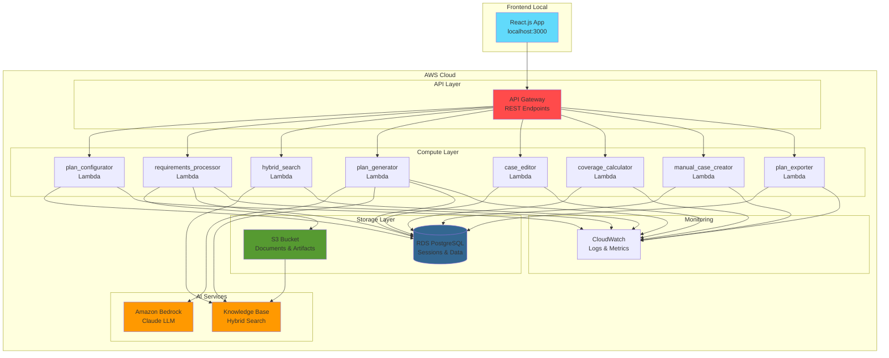
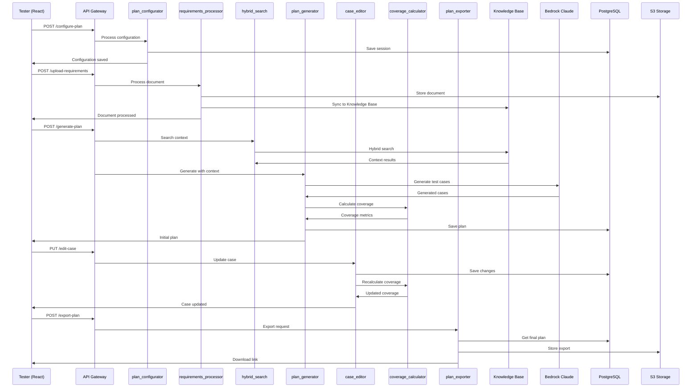

# Sistema de Generación de Planes de Prueba Basado en Agentes IA

## Descripción General

Sistema inteligente que utiliza agentes de IA para generar planes de prueba y casos de prueba a partir de requerimientos funcionales. La solución está diseñada para ser desplegada en AWS e interactuar con testers del proyecto a través de una interfaz web conversacional, permitiendo refinamiento iterativo de los planes generados.

## Características Principales

- **Generación Automática**: Creación de planes de prueba usando Claude (Amazon Bedrock)
- **Interfaz Conversacional**: Refinamiento iterativo de planes mediante chat
- **Edición Interactiva**: Los testers pueden editar, descartar y crear casos manualmente
- **Búsqueda Híbrida**: Consulta semántica y vectorial en Knowledge Base
- **Cobertura Configurable**: Especificación de porcentaje de cobertura funcional deseado
- **Múltiples Tipos de Prueba**: Unitarias, Integración, Performance, Regresión

## Arquitectura del Sistema

### Diagrama de Componentes AWS



#### Diagrama Alternativo con Caracteres ASCII

```
┌─────────────────────────────────────────────────────────────────────────────────────┐
│                                 FRONTEND LOCAL                                      │
│                                                                                     │
│                        ┌─────────────────────────────┐                            │
│                        │      React.js App           │                            │
│                        │    localhost:3000           │                            │
│                        └─────────────┬───────────────┘                            │
└──────────────────────────────────────┼─────────────────────────────────────────────┘
                                       │ HTTPS
                                       ▼
┌─────────────────────────────────────────────────────────────────────────────────────┐
│                                   AWS CLOUD                                        │
│                                                                                     │
│  ┌─────────────────────────────────────────────────────────────────────────────┐   │
│  │                              API LAYER                                     │   │
│  │                                                                             │   │
│  │                    ┌─────────────────────────────┐                        │   │
│  │                    │       API Gateway           │                        │   │
│  │                    │     REST Endpoints          │                        │   │
│  │                    └─────────────┬───────────────┘                        │   │
│  └──────────────────────────────────┼─────────────────────────────────────────┘   │
│                                     │                                             │
│  ┌─────────────────────────────────────────────────────────────────────────────┐   │
│  │                           COMPUTE LAYER                                    │   │
│  │                                                                             │   │
│  │  ┌─────────────┐  ┌─────────────┐  ┌─────────────┐  ┌─────────────┐      │   │
│  │  │plan_config  │  │requirements │  │hybrid_search│  │plan_generator│      │   │
│  │  │Lambda       │  │_processor   │  │Lambda       │  │Lambda        │      │   │
│  │  └─────────────┘  │Lambda       │  └─────────────┘  └─────────────┘      │   │
│  │                   └─────────────┘                                          │   │
│  │                                                                             │   │
│  │  ┌─────────────┐  ┌─────────────┐  ┌─────────────┐  ┌─────────────┐      │   │
│  │  │case_editor  │  │coverage_calc│  │manual_case  │  │plan_exporter│      │   │
│  │  │Lambda       │  │Lambda       │  │_creator     │  │Lambda       │      │   │
│  │  └─────────────┘  └─────────────┘  │Lambda       │  └─────────────┘      │   │
│  │                                     └─────────────┘                       │   │
│  └─────────────────────────────────────────────────────────────────────────────┘   │
│                                     │                                             │
│  ┌─────────────────────────────────────────────────────────────────────────────┐   │
│  │                            AI SERVICES                                     │   │
│  │                                                                             │   │
│  │    ┌─────────────────────┐              ┌─────────────────────┐            │   │
│  │    │   Amazon Bedrock    │              │   Knowledge Base    │            │   │
│  │    │    Claude LLM       │              │   Hybrid Search     │            │   │
│  │    └─────────────────────┘              └─────────────────────┘            │   │
│  └─────────────────────────────────────────────────────────────────────────────┘   │
│                                     │                                             │
│  ┌─────────────────────────────────────────────────────────────────────────────┐   │
│  │                          STORAGE LAYER                                     │   │
│  │                                                                             │   │
│  │    ┌─────────────────────┐              ┌─────────────────────┐            │   │
│  │    │   RDS PostgreSQL    │              │     S3 Bucket       │            │   │
│  │    │  Sessions & Data    │              │ Documents & Artifacts│           │   │
│  │    └─────────────────────┘              └─────────────────────┘            │   │
│  └─────────────────────────────────────────────────────────────────────────────┘   │
│                                     │                                             │
│  ┌─────────────────────────────────────────────────────────────────────────────┐   │
│  │                           MONITORING                                       │   │
│  │                                                                             │   │
│  │                    ┌─────────────────────────────┐                        │   │
│  │                    │       CloudWatch            │                        │   │
│  │                    │     Logs & Metrics          │                        │   │
│  │                    └─────────────────────────────┘                        │   │
│  └─────────────────────────────────────────────────────────────────────────────┘   │
└─────────────────────────────────────────────────────────────────────────────────────┘

Conexiones principales:
• React.js ←→ API Gateway (HTTPS)
• API Gateway ←→ Todas las Lambda Functions
• Lambda Functions ←→ RDS PostgreSQL (datos de sesión)
• requirements_processor ←→ S3 (almacenamiento de documentos)
• hybrid_search ←→ Knowledge Base (búsqueda contextual)
• plan_generator ←→ Bedrock Claude (generación IA)
• S3 ←→ Knowledge Base (sincronización de documentos)
• Todas las Lambda ←→ CloudWatch (logs y métricas)
```

### Diagrama de Flujo de Datos



#### Diagrama de Flujo Alternativo con Caracteres ASCII

```
FASE 1: CONFIGURACIÓN INICIAL
═══════════════════════════════

Tester ──────► API Gateway ──────► plan_configurator ──────► PostgreSQL
(React)        POST /configure      Process config           Save session
   │                                       │
   └◄─────────────────────────────────────┘
              Configuration saved

Tester ──────► API Gateway ──────► requirements_processor ──────► S3 Storage
(React)        POST /upload         Process document              Store doc
   │                                       │                         │
   │                                       └──────► Knowledge Base ◄─┘
   │                                                Sync document
   └◄─────────────────────────────────────────────────────────────────┘
                            Document processed

FASE 2: GENERACIÓN DE PLAN
═══════════════════════════

Tester ──────► API Gateway ──────► hybrid_search ──────► Knowledge Base
(React)        POST /generate       Search context        Hybrid search
   │                                       │                    │
   │                                       └◄───────────────────┘
   │                                      Context results
   │
   │           ┌─────► plan_generator ──────► Bedrock Claude
   │           │       Generate with         Generate test
   │           │       context               cases
   │           │              │                    │
   │           │              └◄───────────────────┘
   │           │             Generated cases
   │           │
   │           │       plan_generator ──────► coverage_calculator
   │           │       Calculate coverage     Coverage metrics
   │           │              │                    │
   │           │              └◄───────────────────┘
   │           │
   │           │       plan_generator ──────► PostgreSQL
   │           │       Save plan              Store plan
   │           │
   └◄──────────┘
   Initial plan delivered

FASE 3: EDICIÓN INTERACTIVA
════════════════════════════

Tester ──────► API Gateway ──────► case_editor ──────► PostgreSQL
(React)        PUT /edit-case       Update case         Save changes
   │                                       │
   │                               case_editor ──────► coverage_calculator
   │                               Recalculate         Updated coverage
   │                                       │                    │
   │                                       └◄───────────────────┘
   └◄─────────────────────────────────────────────────────────────────┘
                            Case updated

FASE 4: EXPORTACIÓN FINAL
═════════════════════════

Tester ──────► API Gateway ──────► plan_exporter ──────► PostgreSQL
(React)        POST /export         Export request        Get final plan
   │                                       │                    │
   │                                       └◄───────────────────┘
   │                               plan_exporter ──────► S3 Storage
   │                               Store export           Store export
   │                                       │                    │
   │                                       └◄───────────────────┘
   └◄─────────────────────────────────────────────────────────────────┘
                            Download link provided

LEYENDA:
────► Flujo de datos
◄──── Respuesta
═════ Separador de fases
```

### Componentes Principales

#### 1. Frontend (React.js - Local)
- Aplicación React.js ejecutándose localmente en modo desarrollo
- Interfaz conversacional para iteraciones con el agente
- Editor interactivo de casos de prueba
- Gestión de configuración de planes
- Exportación en múltiples formatos

**Componentes de UI:**
```jsx
<PlanConfigurationForm />     // Input de datos mínimos
<RequirementsUploader />      // Subida de documento de requerimientos
<TestCaseEditor />           // Editor interactivo de casos
<TestCaseCreator />          // Creador manual de casos
<PlanExporter />             // Exportación final del plan
```

#### 2. Backend (Python + AWS Lambda)
- Funciones Lambda en Python con FastAPI
- Autenticación con AWS Access Key/Secret
- Manejo de sesiones conversacionales
- Integración con servicios AWS

**Arquitectura Lambda:**
```
├── lambda_functions/
│   ├── plan_configurator/        # Procesamiento de configuración inicial
│   ├── requirements_processor/   # Análisis de documento de requerimientos
│   ├── hybrid_search/           # Búsqueda híbrida en KB
│   ├── plan_generator/          # Generación inicial con Claude
│   ├── case_editor/             # Manejo de ediciones del tester
│   ├── coverage_calculator/     # Cálculo de cobertura real
│   ├── manual_case_creator/     # Creación de casos manuales
│   └── plan_exporter/           # Exportación final
```

#### 3. Agente de IA
- **Claude via Amazon Bedrock** como LLM principal
- Capacidad de mantener contexto conversacional
- Integración con AWS Knowledge Base
- Generación limitada por porcentaje de cobertura

### Infraestructura AWS

#### Servicios Core
- **AWS Lambda**: Funciones serverless en Python
- **API Gateway**: Exposición de endpoints REST
- **Amazon Bedrock**: Acceso a Claude
- **AWS Knowledge Base**: Contexto de aplicación con búsqueda híbrida
- **RDS PostgreSQL**: Persistencia de sesiones y datos
- **S3**: Almacenamiento de documentos y artefactos

#### Configuración de Knowledge Base
```python
knowledge_base_config = {
    "search_type": "HYBRID",
    "semantic_search": {
        "enabled": True,
        "weight": 0.6
    },
    "vector_search": {
        "enabled": True,
        "weight": 0.4,
        "embedding_model": "amazon.titan-embed-text-v1"
    }
}
```

## Especificaciones Funcionales

### Inputs del Sistema

#### Datos Mínimos de Entrada
```python
PlanConfiguration = {
    "plan_title": str,                    # Título del plan de pruebas
    "plan_type": enum,                    # UNITARIAS, INTEGRACIÓN, PERFORMANCE, REGRESIÓN
    "functional_requirements_doc": file,   # Documento específico de requerimientos
    "coverage_percentage": int,           # Porcentaje de cobertura deseado (ej: 90%)
    "project_context": str               # Contexto adicional del proyecto
}
```

#### Tipos de Plan Soportados
- **UNITARIAS**: Pruebas de componentes individuales
- **INTEGRACIÓN**: Pruebas de interacción entre módulos
- **PERFORMANCE**: Pruebas de rendimiento y carga
- **REGRESIÓN**: Pruebas de funcionalidades existentes

### Estructura de Casos de Prueba

```python
TestCase = {
    # Campos obligatorios del caso de prueba
    "testcase_number": int,
    "test_case_name": str,
    "test_case_description": str,
    "preconditions": str,
    "test_data": str,
    "test_steps": list[str],
    "expected_results": str,
    "requirements": str,
    "address_master_status": str,
    "cache_availability": str,
    "manual_modal_status": str,
    "address_fields": str,
    "address_standardization": str,
    "order_status": str,
    
    # Campos de gestión
    "priority": enum,           # ALTA, MEDIA, BAJA
    "status": enum,            # PROPOSED, ACCEPTED, DISCARDED, MANUAL
    "created_by": enum,        # AI_AGENT, MANUAL
    "last_modified": datetime,
    "modifications_log": list  # Historial de cambios
}
```

## Flujo de Trabajo

### Fase 1: Configuración Inicial
1. Tester completa formulario con datos mínimos (título, tipo, cobertura)
2. Tester sube documento de requerimientos funcionales
3. Sistema procesa documento y consulta KB con búsqueda híbrida
4. Claude genera propuesta inicial de plan

### Fase 2: Revisión y Edición Interactiva
1. Tester revisa casos de prueba propuestos
2. **Edición directa**: Modifica descripción, pasos, prioridades
3. **Descarte selectivo**: Desmarca casos no deseados
4. **Creación manual**: Agrega casos adicionales con botón "+"
5. **Refinamiento IA**: Solicita ajustes al agente si es necesario

### Fase 3: Finalización
1. Tester valida plan final editado
2. Sistema calcula cobertura real alcanzada
3. Exportación en múltiples formatos (Excel, PDF, JSON)

## Gestión de Documentación

### Knowledge Base (Información General)
- Documentación general de la aplicación
- Patrones de testing históricos
- Mejores prácticas del dominio
- Arquitectura del sistema

### Documento de Requerimientos Funcionales
- Subido específicamente por el tester para cada plan
- Procesado y analizado por Claude
- Usado como fuente primaria para generación de casos
- Almacenado en S3 y referenciado en la sesión

### Flujo de Sincronización
1. Documentos iniciales se suben a **S3**
2. Lambda function procesa y estructura documentos
3. Contenido se sincroniza automáticamente con **Knowledge Base**
4. Knowledge Base se actualiza para consultas contextuales

## Lógica de Cobertura Funcional

### Algoritmo de Cálculo
1. **Análisis de Requerimientos**: Extrae funcionalidades individuales
2. **Priorización**: Clasifica por criticidad y riesgo
3. **Selección**: Elige funcionalidades hasta alcanzar porcentaje objetivo
4. **Generación**: Crea casos de prueba para funcionalidades seleccionadas
5. **Validación**: Verifica que la cobertura alcance el porcentaje solicitado

### Cálculo en Tiempo Real
- Cobertura objetivo vs cobertura real
- Ajuste automático cuando se descartan casos
- Sugerencias para mantener porcentaje objetivo
- Alertas si cobertura cae por debajo del mínimo

## Capacidades de Exportación

### Formatos Soportados
- **Excel**: Con todas las columnas estructuradas
- **PDF**: Formato profesional para documentación
- **JSON**: Para integración con otras herramientas
- **CSV**: Para análisis de datos

## Configuración Técnica

### Frontend Local (React)
```bash
# Configuración local
npm create react-app test-plan-generator
cd test-plan-generator
npm install axios react-router-dom
npm start  # Corre en localhost:3000
```

### Backend Lambda (Python)
```python
# requirements.txt
fastapi==0.104.1
mangum==0.17.0
boto3==1.34.0
psycopg2-binary==2.9.9
pydantic==2.5.0
```

### Estructura de Sesión
```python
Session = {
    "id": "UUID",
    "tester_id": "string",
    "project_context": "string",
    "plan_configuration": "PlanConfiguration",
    "iterations": [
        {
            "iteration_number": "int",
            "user_input": "string",
            "system_response": "string",
            "generated_plan": "object",
            "timestamp": "datetime"
        }
    ],
    "final_plan": "object",
    "status": "enum (active, completed, archived)"
}
```

## Estimación de Costos AWS (Mensual)

- **Lambda Functions** (8 funciones): $15-40
- **API Gateway**: $5-15
- **RDS PostgreSQL**: $25-60
- **Bedrock Claude**: $60-350 (mayor uso por ediciones)
- **Knowledge Base** (búsqueda híbrida): $25-60
- **S3 Storage**: $5-15
- **Total estimado: $135-540/mes**

## Próximos Pasos de Implementación

### Fase 1: Infraestructura Base
- [ ] Configuración de servicios AWS (Lambda, RDS, S3, Bedrock)
- [ ] Setup de Knowledge Base con búsqueda híbrida
- [ ] Configuración de API Gateway

### Fase 2: Backend Development
- [ ] Desarrollo de funciones Lambda
- [ ] Integración con Bedrock Claude
- [ ] Implementación de lógica de cobertura
- [ ] Sistema de gestión de sesiones

### Fase 3: Frontend Development
- [ ] Aplicación React con componentes interactivos
- [ ] Editor de casos de prueba
- [ ] Sistema de exportación
- [ ] Interfaz conversacional

### Fase 4: Integración y Testing
- [ ] Integración completa frontend-backend
- [ ] Testing de funcionalidades
- [ ] Optimización de prompts para Claude
- [ ] Validación de cobertura funcional

### Fase 5: Deployment y Documentación
- [ ] Deployment en AWS
- [ ] Documentación técnica
- [ ] Guías de usuario
- [ ] Monitoreo y logging

## Consideraciones de Seguridad

- Autenticación con AWS Access Key/Secret
- Aislamiento de red con VPC
- Encriptación de datos en tránsito y reposo
- Logs de auditoría en CloudWatch
- Control de acceso a Knowledge Base

## Monitoreo y Observabilidad

- **CloudWatch** para logs y métricas
- Monitoreo de costos de Bedrock
- Alertas de rendimiento de Lambda
- Tracking de uso de Knowledge Base
- Métricas de satisfacción del usuario

---

**Versión**: 1.0  
**Fecha**: Septiembre 2025  
**Estado**: Definición Completa - Listo para Implementación
